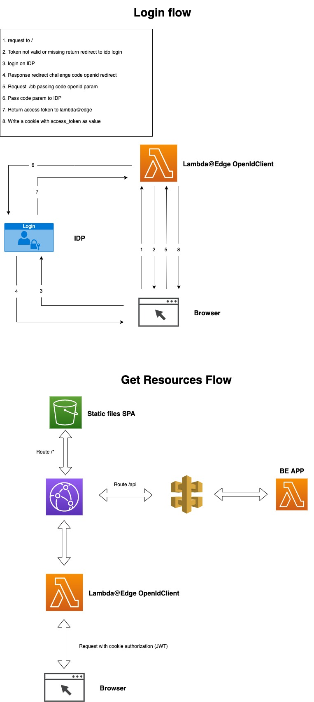

# Deploy todoapp aws
Simple example for deploying a simple todo app with authentication with terraform using the following stack:
* AWS DynamoDB
* AWS ApiGW
* AWS Lambda
* AWS Lambda@Edge
* AWS Cloudfront
* AWS S3
* External IDP provider (for example KeyCloak)

## High level architecture

## Steps for installing
* Run `./clone.sh`
* Configure terraform properties (You can see them on variable.tf)
* Deploy with terraform (es. running `terraform apply`)